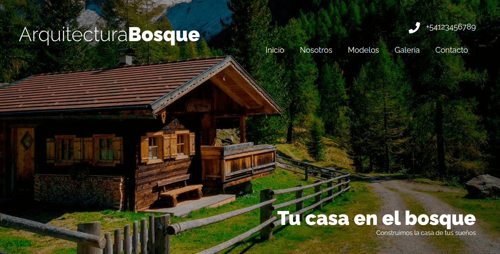
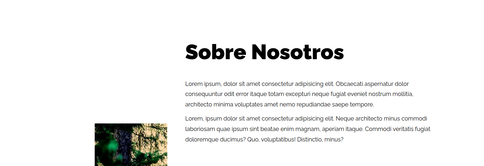
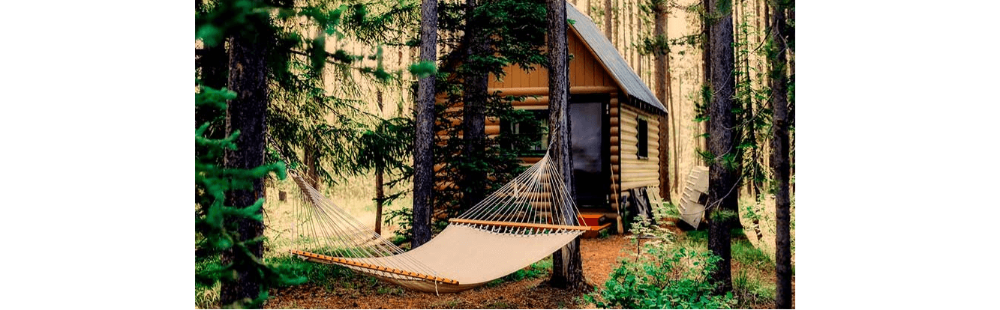
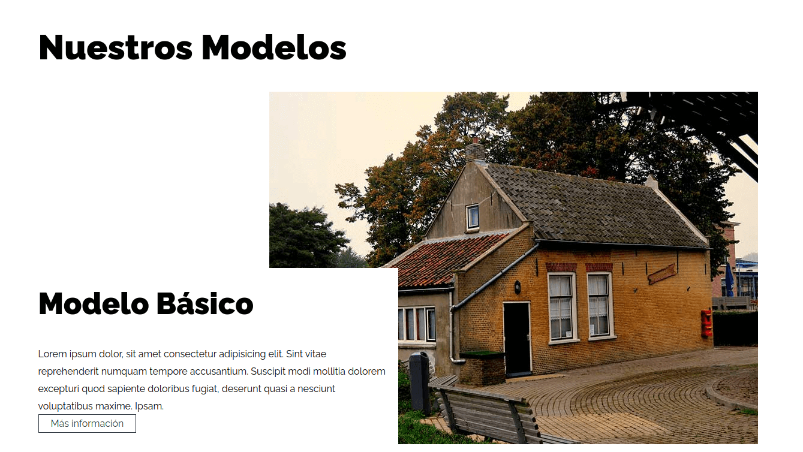
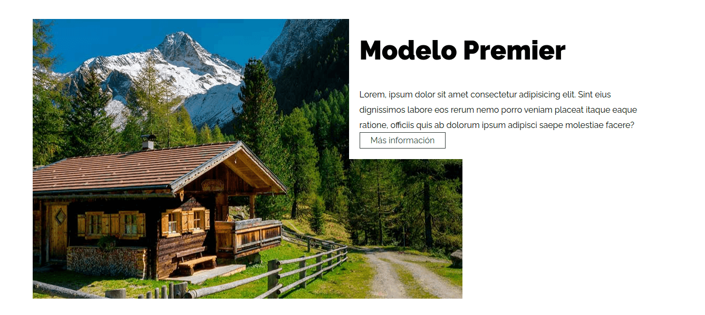
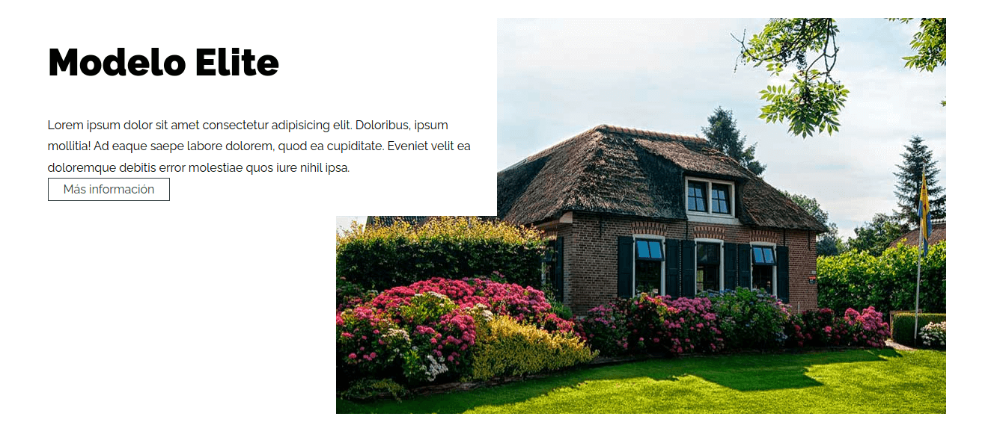
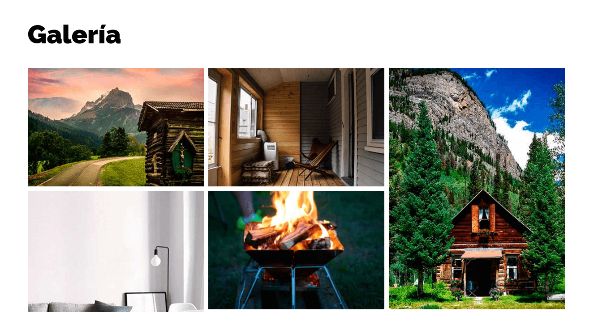
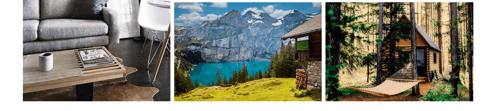
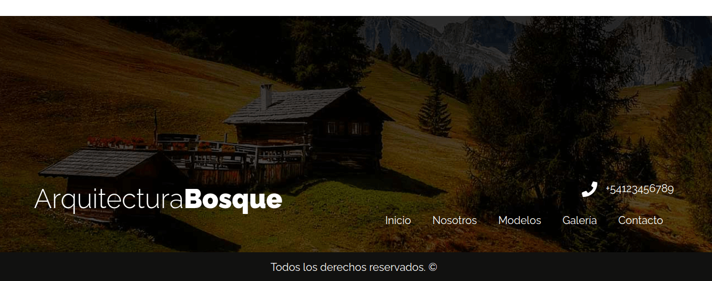

# Architecture











## Installation

### clone repo **(gh CLI)**
```
gh repo clone norbix14/css-architecture architecture
```

### go to folder
```
cd architecture
```

### run app
* double click on **index.html**
* open with **Live Server**
